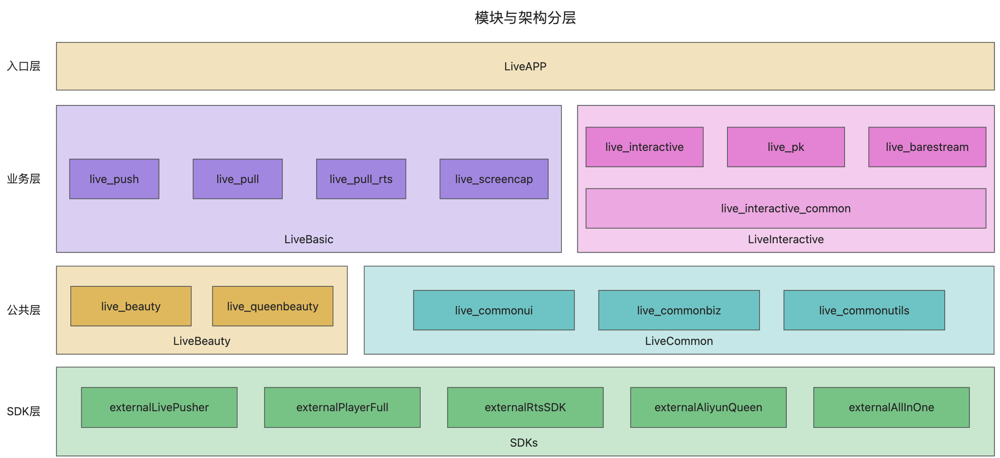
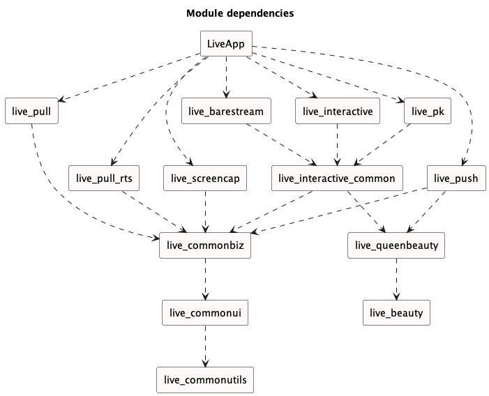

# amdemos-android-live

本项目是阿里云推流 SDK 的 Demo 演示工程（API Example），旨在帮助开发者快速了解、集成并测试阿里云推流 SDK 的功能。

----

## **一、Demo 体验**

> **官网文档**：[推流SDK · Demo体验](https://help.aliyun.com/zh/live/developer-reference/sdk-download-and-release-notes?#section-cra-t8n-o2q)

通过扫描以下二维码，您可以快速下载并体验 Demo 应用：


---

## **二、Demo 编译**

> **官网文档**：[Android推流SDK · Demo编译](https://help.aliyun.com/zh/live/developer-reference/push-sdk-for-android-demo-compilation)

### **1. 开发环境准备**

* **IDE：推荐使用 Android Studio**

> [Download Android Studio & App Tools - Android Developers](https://developer.android.com/studio?hl=zh-cn)

* **JDK 版本：JDK 11**

> JDK 11设置方法：Preferences -> Build, Execution, Deployment -> Build Tools -> Gradle -> Gradle JDK -> 选择 11（如果没有11，请升级你的Android Studio版本）

### **2. 项目结构说明**

#### **2.1 模块与架构分层**



#### **2.2 模块依赖关系**



#### **2.3 模块功能介绍**

```html
.
├── AndroidThirdParty # 三方依赖目录，用于管理项目依赖的三方SDK及版本
│   └── config.gradle
├── LiveApp # Demo Application入口
├── LiveBasic # 基础直播目录，包含所有基础直播的功能模块
│   ├── live_pull # RTMP基础直播拉流功能
│   ├── live_pull_rts # RTS低延迟直播拉流功能
│   ├── live_push # 摄像头推流功能
│   └── live_screencap # 录屏推流功能
├── LiveBeauty # 直播美颜目录，包含基础直播/互动直播的美颜前处理解决方案
│   ├── README.md # 直播美颜说明文档
│   ├── live_beauty # 直播美颜-抽象接口模块
│   └── live_queenbeauty # 直播美颜-基于Queen SDK的封装实现模块
├── LiveCommon # 公共组件目录，包含Demo工具类、公共业务等
│   ├── live_commonbiz # 直播Demo公共业务模块
│   ├── live_commonui	# 直播Demo公共UI模块
│   └── live_commonutils # 直播Demo工具类模块
├── LiveInteractive # 互动直播目录，包含所有互动直播的功能模块
│   ├── live_barestream # 互动直播-推拉裸流功能
│   ├── live_interactive # 互动直播-连麦功能
│   ├── live_interactive_common # 互动直播-公共模块
│   └── live_pk # 互动直播-PK功能
├── README.md # 项目说明文档
├── build.gradle
├── gradle
│   └── wrapper
```

#### **2.4 功能列表**

| 功能名称   | 模块名称         | 功能场景       | 推拉流协议                                                   |
| ---------- | ---------------- | -------------- | ------------------------------------------------------------ |
| 摄像头推流 | live_push        | 推流（摄像头） | 基础直播(rtmp/rts 1.0/rts 2.0)，互动直播(rtc)，推拉裸流(rts 2.0) |
| 录屏推流   | live_screencap   | 推流（录屏）   | 基础直播(rtmp/rts 1.0/rts 2.0)                               |
| 拉流播放   | live_pull        | 拉流           | 基础直播(rtmp/rts 1.0/rts 2.0)                               |
| 连麦互动   | live_interactive | 推拉流（连麦） | 互动直播(rtc)                                                |
| PK互动     | live_pk          | 推拉流（PK）   | 互动直播(rtc)                                                |
| 推拉裸流   | live_barestream  | 推拉流         | 推拉裸流(rts 2.0)                                            |

----

## **三、SDK 集成**

>  **官网文档**：[Android推流SDK · SDK集成](https://help.aliyun.com/zh/live/developer-reference/integrate-push-sdk-for-android)

### **推荐使用 Maven 集成：**

| SDK名称                     | SDK类型       | 功能   | 支持模式           | 推拉流协议                                                   |
| --------------------------- | ------------- | ------ | ------------------ | ------------------------------------------------------------ |
| AlivcLivePusher             | 推流SDK       | 推流   | 基础模式           | 基础直播(rtmp/rts 1.0/rts 2.0)                               |
| AlivcLivePusher_Interactive | 推流SDK       | 推流   | 基础模式、互动模式 | 基础直播(rtmp/rts 1.0/rts 2.0)，互动直播(rtc)，推拉裸流(rts 2.0) |
| AliVCSDK_BasicLive          | 音视频终端SDK | 推拉流 | 基础模式           | 基础直播(rtmp/rts 1.0/rts 2.0)                               |
| AliVCSDK_InteractiveLive    | 音视频终端SDK | 推拉流 | 基础模式、互动模式 | 基础直播(rtmp/rts 1.0/rts 2.0)，互动直播(rtc)，推拉裸流(rts 2.0) |
| AliVCSDK_Standard           | 音视频终端SDK | 推拉流 | 基础模式、互动模式 | 基础直播(rtmp/rts 1.0/rts 2.0)，互动直播(rtc)，推拉裸流(rts 2.0) |

### **1. 配置License**

推流 SDK 需要 License 授权才能正常使用，请参考 [推流 SDK License 集成指南](https://help.aliyun.com/zh/live/developer-reference/integrate-a-push-sdk-license) 完成配置。

### **2. 添加 Maven 源**

在项目的 build.gradle 文件中添加以下 Maven 源地址：

```groovy
maven { url 'https://maven.aliyun.com/nexus/content/repositories/releases' }
```

### **3. 在 build.gradle 中添加依赖**

根据业务需求选择对应的 SDK 版本进行集成：

```groovy
// 1. 基础版推流 SDK（不支持连麦）
implementation 'com.alivc.pusher:AlivcLivePusher:x.y.z'

// 2. 互动版推流 SDK（支持连麦）
implementation 'com.alivc.pusher:AlivcLivePusher_Interactive:x.y.z'
```

**注意**：`x.y.z` 表示推流 SDK 的版本号。您可以在 [SDK 下载页面](https://help.aliyun.com/zh/live/developer-reference/sdk-download-and-release-notes) 查看最新稳定版本号，并将其替换为实际值。

### **4. 配置 CPU 架构**

目前 SDK 支持 armeabi-v7a 和 arm64-v8a，不支持模拟器调试。请在 defaultConfig 中配置：

```groovy
defaultConfig {
  ndk {
    abiFilters "armeabi-v7a", "arm64-v8a"
  }
}
```

### **5. 其它工程配置**

* **[配置App权限](https://help.aliyun.com/zh/live/developer-reference/integrate-push-sdk-for-android#12c072b07azus)**

* **[配置混淆规则](https://help.aliyun.com/zh/live/developer-reference/integrate-push-sdk-for-android#5c0354b07anys)**

----

## **四、常见问题 FAQ**

* **美颜接入指南**

​	参考 **LiveBeauty** 模块下的 `README.md` 文档，通过 LiveBeauty 插件一键集成直播美颜功能。

* **SDK集成问题：集成多个SDK冲突**

  * 如果同时集成了多个阿里云音视频 SDK（如 [直播推流SDK](https://help.aliyun.com/zh/live/developer-reference/push-sdk-for-android/) 和 [播放器SDK](https://help.aliyun.com/zh/vod/developer-reference/apsaravideo-player-sdk-for-android/)），可能会出现字节码冲突问题（Duplicate class）。
  * 建议使用**音视频终端 SDK** 避免冲突，集成方式请参考 [标准集成 · Android 端](https://help.aliyun.com/zh/apsara-video-sdk/developer-reference/fast-integration-for-android)。

* **SDK集成方式**
  * 如您希望以本地 aar 形式集成，我们在官网文档[SDK下载与发布记录](https://help.aliyun.com/zh/live/developer-reference/sdk-download-and-release-notes)中，为您提供了 SDK 下载包。
  * 如您希望以音视频终端 SDK 形式集成，集成方式请参考[标准集成·Android端](https://help.aliyun.com/zh/apsara-video-sdk/developer-reference/fast-integration-for-android)。

* **Demo编译配置**

  * **基础版 与 互动版 切换**
    
    * `gradle.properties `文件中 `sdk_type` 编译配置，决定输出的 Demo 功能模块
    * `AliVCSDK_BasicLive` -> 基础版，`AliVCSDK_InteractiveLive` -> 互动版
    * 基础版，仅包含基础直播相关功能；互动版，包含基础直播与互动直播功能
    
  * **直播推流 SDK 与 音视频终端 SDK 切换**
    
    在 `gradle.properties` 文件中，通过 `allInOne` 参数决定使用的 SDK 类型：
    
    * `true`：使用音视频终端 SDK。
    * `false`：使用直播推流 SDK。
    
    对应关系如下：
    
    |                    |    sdk_type=AliVCSDK_BasicLive    |      sdk_type=AliVCSDK_InteractiveLive       |
    | ------------------ | :-------------------------------: | :------------------------------------------: |
    | **allInOne=false** | com.alivc.pusher:AlivcLivePusher  | com.alivc.pusher:AlivcLivePusher_Interactive |
    | **allInOne=true**  | com.aliyun.aio:AliVCSDK_BasicLive |   com.aliyun.aio:AliVCSDK_InteractiveLive    |
    

* **Gradle Distribution 无法访问**

​	如果遇到 Gradle Distribution 无法访问的问题，可能是因为网络连接不稳定。建议更换 Gradle 源地址或检查本地网络环境。

-----

## **五、链接指引**

### **1. 文档**

* [阿里云·视频直播](https://www.aliyun.com/product/live)
* [推流SDK](https://help.aliyun.com/zh/live/developer-reference/push-sdk)
* [直播连麦](https://help.aliyun.com/zh/live/user-guide/co-streaming-overview)
* [直播连麦快速入门](https://help.aliyun.com/zh/live/user-guide/quick-start-live-co-streaming)
* [音视频终端SDK](https://help.aliyun.com/zh/apsara-video-sdk/)

### **2. 控制台**

* [直播控制台](https://live.console.aliyun.com/)
* [直播连麦控制台](https://live.console.aliyun.com/connect_microphone/demo#/liveRtc/list)
* [License控制台](https://live.console.aliyun.com/connect_microphone/demo#/sdks/license)

### **3. Global**

* [ApsaraVideo Live](https://www.alibabacloud.com/zh/product/apsaravideo-for-live)
* [Push SDK](https://www.alibabacloud.com/product/apsaravideo-for-live/streaming-sdk)
* [Push SDK Doc](https://www.alibabacloud.com/help/en/live/developer-reference/push-sdk/)
* [Interactive streaming](https://www.alibabacloud.com/help/en/live/user-guide/interactive-streaming-overview)

### **4. 其它**

* **历史下载包追溯**

  在 [SDK 下载与发布记录](https://help.aliyun.com/zh/live/developer-reference/sdk-download-and-release-notes) 页面中，您可以找到最新的 SDK 下载包（包括 SDK、Demo 源码、API 文档等）。如果需要追溯历史版本，可以手动修改下载地址中的版本号进行下载。

* [SDK隐私权政策及合规使用说明](https://help.aliyun.com/zh/live/developer-reference/sdk-download-and-release-notes#76a8fc617eqqa)

----

## **六、帮助**

如果您在使用推流 SDK 有任何问题或建议，欢迎通过 [推流SDK异常自助排查](https://help.aliyun.com/zh/live/developer-reference/push-stream-sdk-exception-self-service-troubleshooting) 获取技术支持。
